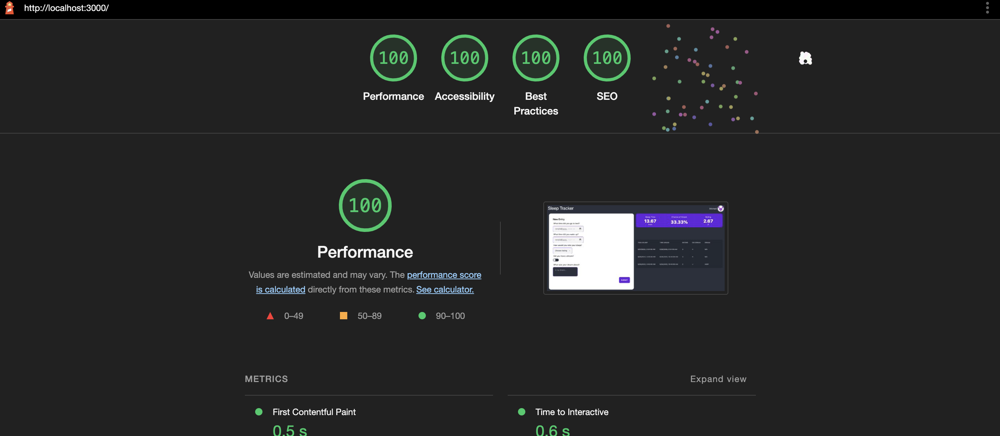

Assignment 3 - Persistence: Two-tier Web Application with Database, Express server, and CSS template
===

## Sleep Tracker

https://webware-a3.herokuapp.com/

- Application Goal
    - The goal of the application is to allow users to track some simple metrics about their sleep and get basic metrics
      based on that data.
- Challenges
    - One challenge I faced in creating this application were not changing the Github Oauth callback url from local host
      when deploying to Heroku.
- Authentication Strategy
    - I chose to implement the Github authentication strategy as it allowed me to not have to store user passwords in
      my database.
- CSS Framework
    - I used TailwindCSS in combination with DaisyUI. I used Tailwind because I am both familiar with it, and it's
      trimming of unused styles leads to smaller bundle sizes. In addition, DaisyUI was used for its prebuilt
      components.
- Middlewares
  - express.static('public')
    - Used to serve the static files that do not require authentication.
  - express.json()
    - Used to parse the json body of incoming web requests.
  - session
    - Used to keep track of the cookies an user session.
  - isLoggedIn
    - Used to check if a user is logged in.
  - favicon
    - Used to serve the favicon.

## Technical Achievements

- **Tech Achievement 1**: I used OAuth authentication via the GitHub strategy to provide the login functionality.
- **Tech Achievement 2**: I used Heroku to host my site.
- **Tech Achievement 3**: I scored 100 on all applicable lighthouse criteria
  - 
