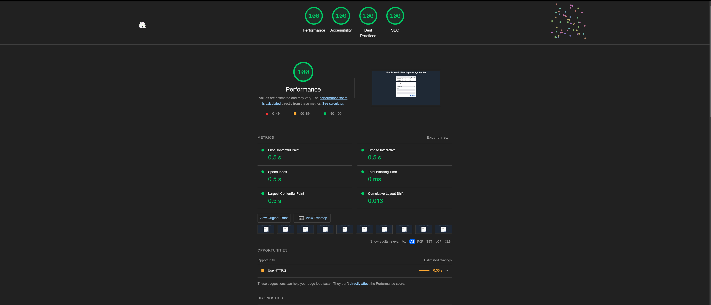
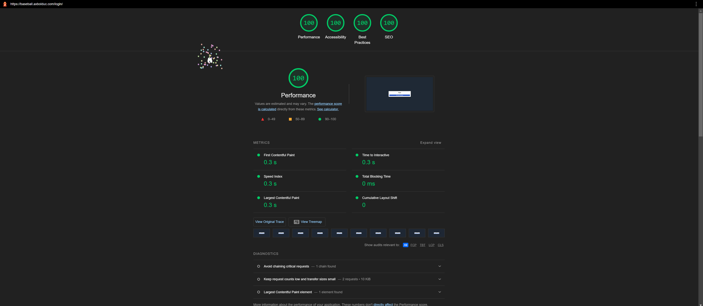

Assignment 3 - Persistence: Two-tier Web Application with Database, Express server, and CSS template
===

## Simple Baseball Batting Average Tracker

[Link to app hosted on personal VPS - Vultr](https://baseball.axbolduc.com)

## Summary

For this project I decided to build on top of the baseball batting average tracker that I created in assignment 2. 

The goal was to have a website that would allow you to log in with github, report game totals and have the website calculate and store your batting average for that game. The site would then display only your game totals back to you.

One of the biggest challenges with realizing this goal was implemeting OAuth with github as OAuth is a very intricate and finicky process. However I was able to implement it with the help of passport.js and the github2 strategy. I decided on passport.js because I have used it in the past for a personal project and found it greatly simplified the implementation of OAuth authentication.

For styling I went with the CSS framework tailwindcss. Tailwind is a utility class based framework that I also have experience with. It afforded me great flexibility with the wide range of classes it provided while also minimizing the amount of low level styling decisions that had to be made.

Express Middleware:
- `express-session`: A third-party middleware package that enables express to work with session-based authentication
- `express.static`: Middleware for serving static files like html, css, and js 
- `helmet`: A middleware package that automatically sets various http headers to help secure the express application. 
- `passport`: Authentication middleware that allowed for easy implementation of OAuth with github
- `requireAuth`: Custom middleware function that requires authentication for a route. If the request is not authenticated the user is redirected to the login route.
## Technical Achievements
- **OAuth with Gihub**: I used passport.js to implement OAuth with github allowing users to login via their github accounts.
- **Alternative Hosting site**: This website is hosted on my personal VPS hosted by Vultr and is also served by a custom subdomain. This was a fun exercise as I havent really touched this server in a while. Its good because it is always online and does not need to "wake up" like glitch. However it was much more complicated to set up, especially alongside my personal website.
- **Perfect 100 lighthouse score**: In desktop lighthouse tests all of the scores reach the perfect 100 rating as seeen below.

Lighthouse results for authenticated user with data

Lighthouse results on the login page for unauthenticated user