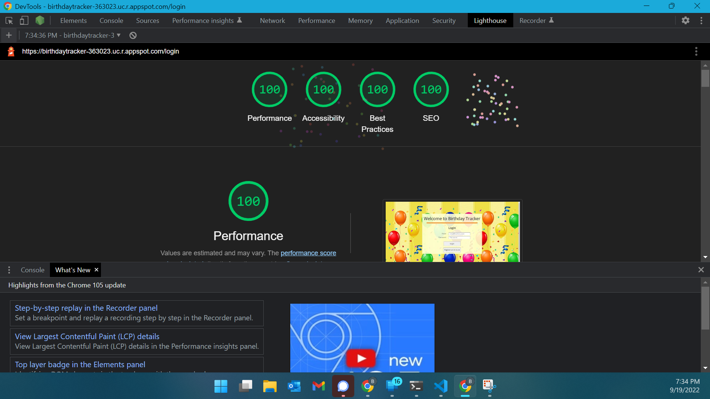
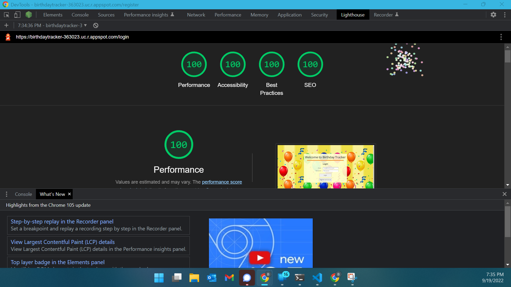
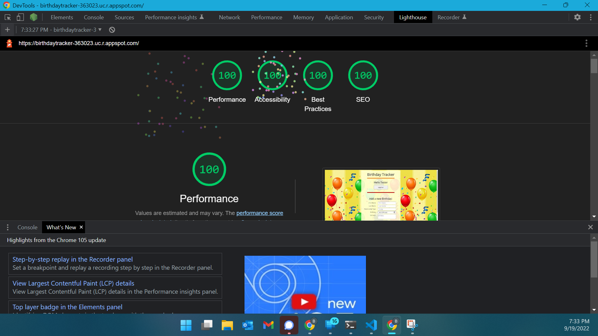

## Birthday Tracker

[**Birthday Tracker**](https://birthdaytrkr.botsak.com/)

If you do not want to register an account, login in with the following test user credentials: 

  - Email: test@user

  - Password: hardtoguess

Please be sure to delete all saved birthdays with personal/private information otherwise future test users will be able to see that information.

- The goal of this application was to improve on the Birthday Tracker I developed in the last assignment by adding user authentication and persistent storage. 
- One of the biggest challenges for me in developing this application was understanding how to develop an authentication method. 
- I chose to use the `cookie-session` middleware for my authentication because it seemed easiest to implement. 
- I used the [**modern-css-reset**](https://github.com/hankchizljaw/modern-css-reset) template file that resets certain styles applied by browsers so that I could reuse my CSS from assignment 2. 
- 5 middleware packages used in the server
  - `serve-favicon`: Used to serve the favicon image.
  - `express.static`: Used this built-in middleware to serve files in the public directory.
  - `express.json`: Used this built-in middleware to parse JSON body's of incoming requests.
  - `cookie-session`: Used to establish a cookie session when the user logs in. 
  - Custom middleware function `routeDecider`: Checks to see if cookie session is established, if it is then the request is routed using an authenticated router, if it isn't the request is routed using a non-authenticated router. It also logs to the console the request url and which router was used to route the request. 

## Technical Achievements
- **Tech Achievement 1**: Host site on a different service from Glitch
    - I chose Google Cloud App Engine to host my application because I use Firebase to host my personal website so I wanted to learn more of the Google Cloud platform. It was definitley a bit more work to get it setup, including creating an app.yaml file that is used by App Engine. ([See the fork on my personal account used for hosting](https://github.com/benSakac/birthdayTracker)) I also configured a custom domain (a subdomain of my personal domain) for the application.
- **Tech Achievement 2**: 100% in all 4 lighthouse tests 
  - 
Lighthouse results on the login page for unauthenticated user
 - 
Lighthouse results on the register page for unauthenticated user
 - 
Lighthouse results on the main page for authenticated user

## Design/Evaluation Achievements
- **Design Achievement 1**: I followed the following tips from the W3C Web Accessibility Initiative...
    - Writing
        - Tip #1: Provide informative and unique page titles 
    - Designing 
        - Tip #2: Provide sufficient contrast between foreground and background
        - Tip #3: Ensure that form elements include clearly assosciated labels
        - Tip #4: Provide easily identifiable feedback 
        - Tip #5: Use headings and spacing to group related content 
        - Tip #6: Create designs for different viewport sizes
    - Developing
        - Tip #7: Assosciate a label with every form control 
        - Tip #8: Use mark-up to convey meaing and structure
        - Tip #9: Help users avoid and correct mistakes