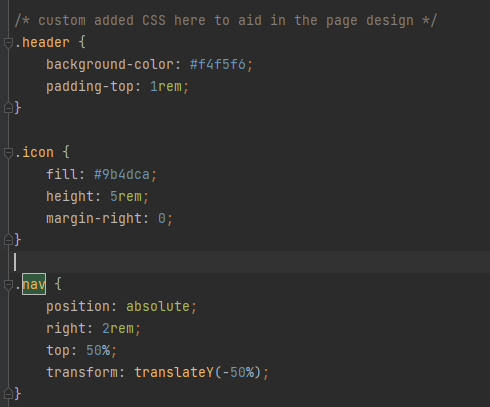
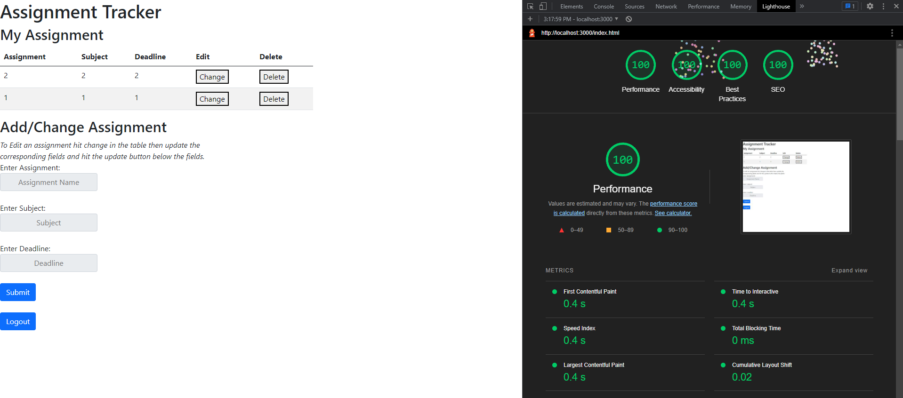

Mason Powell https://a2-finalhalation.glitch.me/

This project shows ...
## Technical Achievements
Technical Achievement #3: I got 100% in all four lighthouse tests on both pages of my website.
Login Page:

Main Page:

## Design Achievements
Design Achievement #1:
1. Use headings to convey meaning and structure - The table has headings to tell you what you are inputting and what you are looking at and the login page tells you where to login or signup
2. Provide informative, unique page titles - The Login Page and Assignment Page clearly tells the user what the page is doing
3. Ensure that all interactive elements are keyboard accessible - You may use tab and enter to navigate the website
4. Don’t use color alone to convey information - I have alert pop-ups to inform the reader that the login is wrong 
5. Ensure that form elements include clearly associated labels - The labels to the input fields clearly tell you what you should input
6. Provide clear instructions - The webpage is designed so that the user should be able to read the fields and understand how the website works
7. Use headings and spacing to group related content - The "Assignment Tracker" title is the largest thing on each page while I use spacing and line breaks to keep other elements grouped
8. Provide easily identifiable feedback - By using alert-pops this allows the user to get very identifiable feedback
9. Ensure that interactive elements are easy to identify - The main buttons of the webpages are blue and are different from the table buttons to make them easy to identify 
10. Help users avoid and correct mistakes - When a user tries to signup with a username that is taken an alert pop-up will tell the user that the username is taken
11. Keep content clear and concise - The two pages are relatively simple, there aren't large texts walls or anything to confuse the user
12. Provide clear and consistent navigation options - I ensured that navigation across pages within a website has consistent naming, styling, and positioning all forms are on the left side 
