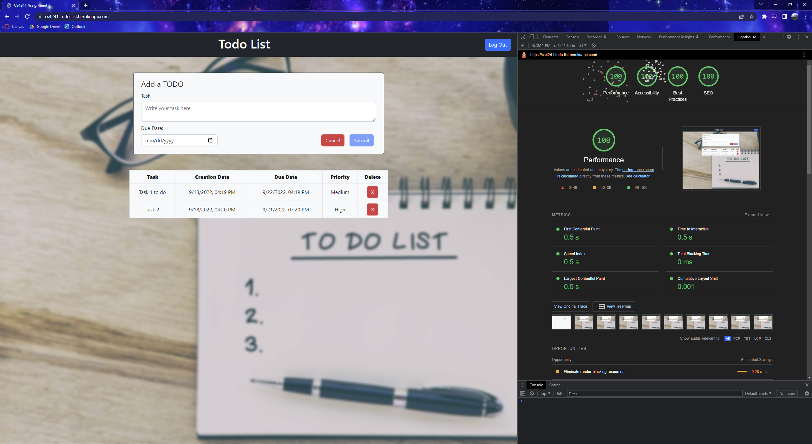
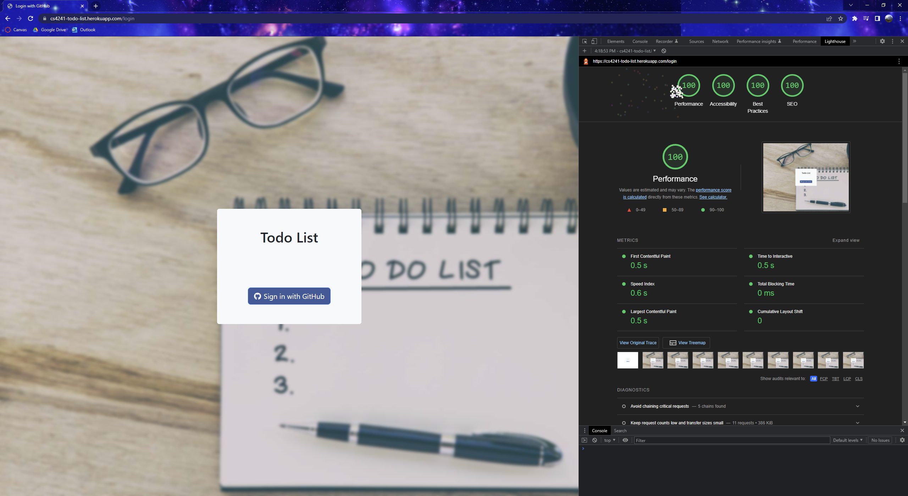

Assignment 3 - Persistence: Two-tier Web Application with Database, Express server, and CSS template
===

## Todo List

https://cs4241-todo-list.herokuapp.com/

For this project, I built upon the todo list that I created for Project 2. Some additions in this one include using your GitHub account as authentication, keeping persistent data by using MongoDB, and changing the edit functionality to clicking on the row instead of a button. I also cleaned up the backend significantly to be simpler and more robust.

The goal of the application is to provide the ability for people to keep track of whatever tasks they need to do, as well as their due dates. It will automatically assign priorities to tasks based on how close their due date is to the current time, marking them as late if the due date has already passed. When a user first visits the page, they are redirected to a login page where they log in with their GitHub account. They are then redirected to the main page. The main page has a form that permits users to add and modify tasks, as well as a table below to display (only) their tasks and delete tasks.

The two biggest challenges I faced in realizing the application were:  
1) Implementing OAuth and using GitHub as the strategy. It was difficult to debug at times, but I do have a much better understanding of how OAuth works and how powerful and useful it is.
2) Bootstrap was either really useful, or nothing I did worked, especially trying to add margins/padding between elements. Plus, some of their documentation was out of date, which certainly didn't help either.

As I mentioned, I used GitHub as the authentication strategy because it seemed simpler than implementing usernames/passwords myself and also more secure. Plus, it was nice being able to log in with my GitHub account quickly.

Also as I mentioned, I used Bootstrap as my CSS framework. It seemed like one of the most popular frameworks to use, so I figured it would be easiest to learn and use as well. Unfortunately, with the incomplete/wrong documentation and no doubt, my inexperience, it was definitely one of the most difficult parts of the project for me. I authored some custom CSS, either because Bootstrap did not have the ability to do something I wanted, or just because it was a quick fix that worked. The custom CSS I used was:
1) Blurring the background image I used, which was built upon the bg-image capability that Bootstrap supports
2) Changing some padding of some divs slightly, as well as the width of the due date time picker

Express Middleware I used:
1) `express-session` Middleware that lets express work with session-based authentication
2) `passport` Middleware that allows for various strategies for OAuth, including GitHub
3) `helmet` Middleware that sets various HTTP headers for security-related purposes
4) `cors` Middleware that can be used to enable CORS with various options
5) `morgan` Middleware to log HTTP requests and errors
6) `connectionChecker` Custom middleware that checks the connection to the MongoDB database and if there is no connection, returns a 503 error
7) `ensureAuthenticated` Custom middleware that makes sure the user is authenticated for any route provided, and if they are not, they are redirected to the login page

## Technical Achievements
- **OAuth Authentication**: I used OAuth authentication via the GitHub strategy by using passport.js, which lets users log in with their GitHub accounts.
- **Alternative Hosting Site**: I used Heroku as an alternative hosting site to Glitch. Overall, I did enjoy using it and it was quick to set up. It was more abstracted than Glitch, but did not limit what I could do. One feature I appreciated was linking to the GitHub repo, so whenever I pushed to master, it would automatically redeploy. The only downside of using this is that the free version of Heroku is going away in November.
- **Lighthouse Scores of 100**: In both the login and the main page, all of the four scores reach perfect 100 (with fireworks!) as seen in the images below.

Lighthouse Results for the Main Page

Lighthouse Results for the Login Page

### Design/Evaluation Achievements
N/A
